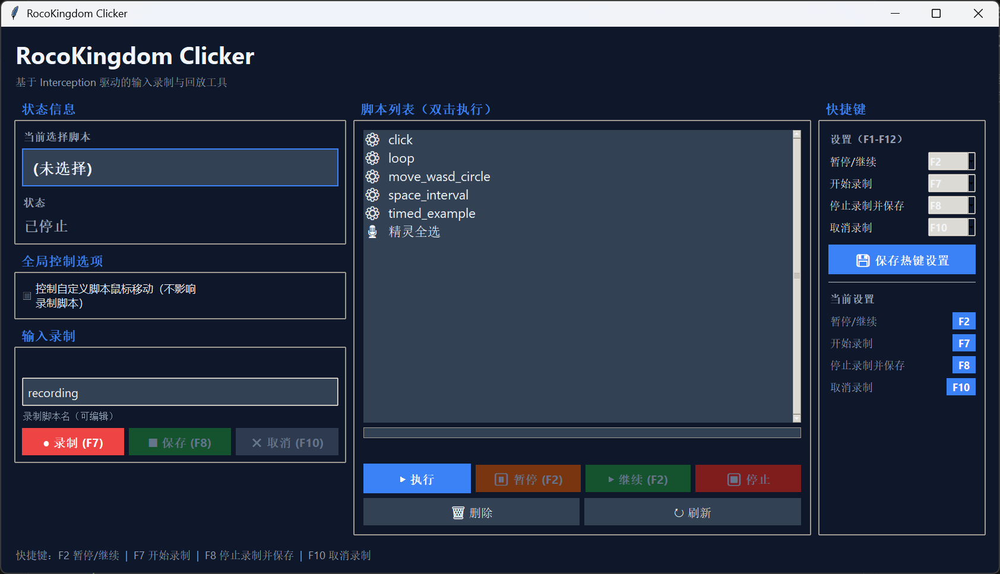

# RocoKingdom 连点器（RocoKingdom Clicker）

本项目用于在《洛克王国：世界》中自动执行重复、固定的鼠标/按键动作，以减少玩家手动重复操作的负担。

> 请注意：使用自动化工具存在被封禁的风险，使用者须自行承担风险与后果。

## 启动与运行

### 前置步骤

按照 [说明](docs/DRIVER_INSTALLATION.md) 安装驱动。

### 使用发布包运行

下载并解压发布包后，双击 `run_clicker.vbs` 来启动。该 VBS 会在需要时弹出 UAC 提示以提升权限，确认后程序以静默窗口（无控制台）方式运行，适合普通最终用户。

### 开发与调试（源码运行）

当你需要修改代码、调试或查看详细日志时，使用源码运行：

```bat
python Clicker.py --gui
```

备用（会显示控制台）：

```bat
run_clicker.bat
```

开发运行注意事项：

- 需要在运行机器上安装 Python（推荐 3.10）。

### 执行脚本



上图为软件的用户界面：

- 列表：显示 `data/action_scripts/` 下的脚本文件，点击脚本会立即更新左侧“当前选择脚本”标签。
- 按钮：`启动 / 停止`、`执行脚本`、`删除脚本`、`切换 move_mouse`。
- 状态：状态栏会显示运行状态（如脚本运行中、脚本已暂停、倒计时等）；“当前选择脚本”栏只显示脚本名。

你可以通过热键来启动或暂停脚本：
- `F2`：暂停脚本（状态栏显示“脚本已暂停”）。
- `F1`：继续（继续前会再次等待 3 秒倒计时）。

注意：热键监听使用全局键盘钩子（WH_KEYBOARD_LL），记录按键事件但不拦截原按键，因此游戏的原生按键功能仍然保留。

## 脚本系统
- 脚本文件位于 `data/action_scripts/`，请按 `SCRIPT_RULES.md` 的格式编写动作序列。
- 新增动作类型：`timed`，用于在脚本内部指定“运行时长后停止/退出”或其它定时条件。
- 支持动作类型：`click`, `move`, `key`, `combo`, `wait`, `loop`, `timed`。
- 类人化选项（抖动）：`x_jitter_px`, `y_jitter_px`, `hold_jitter_ms`, `duration_jitter_ms`, `pause_jitter_ms`。

行为细节：
- 全局 `move_mouse` 配置控制 `click` 是否移动鼠标；若 `move_mouse=false`，`click` 只发送按下/释放事件，不会移动鼠标；GUI 中会显示 `ignored_moves`（因全局禁止而被忽略的移动次数）。

示例（简要）：

```json
{
  "name": "example_loop",
  "actions": [
    {"type": "loop", "count": 0, "actions": [
      {"type": "move", "x": 900, "y": 500, "duration_ms": 120},
      {"type": "click", "x": 900, "y": 500, "hold_ms": 80},
      {"type": "wait", "duration_ms": 300}
    ]}
  ]
}
```

更多示例与规范请参阅 `data/action_scripts/SCRIPT_RULES.md`。

仓库内示例脚本概览

以下为 `data/action_scripts/` 目录下自带脚本的简要说明，便于快速理解和测试：

- `click.json` (`script_0`)
  - 说明：基于 `timed` 的周期性点击示例。每个执行窗口（60s）内不断执行一次点击+短等待，然后休眠 1s 后重复（`forever: true`）。包含坐标抖动与按压抖动，模拟更类人的点击行为。
  - 用途：适合需要周期性短时连续点击的场景。通过 GUI 选择并执行该脚本。

- `loop.json` (`script_1`)
  - 说明：无限循环的基础连点示例。每轮移动到固定坐标、点击并等待 300ms，`count:0` 表示一直循环直到用户停止脚本（通过 GUI 停止）。
  - 用途：用于持续的单点点击循环测试或替代简单连点器行为。

- `move_wasd_circle.json` (`move_wasd_circle`)
  - 说明：通过 `combo` 动作模拟 WASD 转圈（W+D, D+S, S+A, A+W）并在每步加入等待与抖动，适合需要持续移动的场景（例如游戏内挂机移动）。
  - 用途：测试键盘组合动作、移动类脚本或自动走位场景。

- `space_interval.json` (`space_interval`)
  - 说明：按空格键（VK 32）并定期等待约 1.5s 的循环示例，带微小抖动。用于需要定期按键触发的场景（例如间隔触发技能/互动）。
  - 用途：节奏型按键测试或模拟周期性空格输入场景。

- `timed_example.json` (`timed_example`)
  - 说明：`timed` 示例：执行窗口 5s、休眠 2s、重复 2 次；在每个执行窗口内以 `loop` 连续点击并等待，用于展示 `timed` 的基本用法。
  - 用途：学习如何使用 `timed` 包装器实现“工作窗口 + 休眠窗口”的运行模式。

使用提示：在 GUI 中可以直接选择并运行上述脚本；脚本触发的热键已简化，请使用界面按钮或脚本列表来执行脚本。

详细动作说明（快速参考）

- `click`：移动到 `(x,y)` 并单次点击。
  - 字段：`type: "click"`, `x`, `y`, 可选 `hold_ms`（默认 ~100ms）。
  - 注意：当全局 `move_mouse=false` 时，仅发送按下/释放事件，不移动鼠标。

- `move`：移动到 `(x,y)`，不点击。
  - 字段：`type: "move"`, `x`, `y`, 可选 `duration_ms`（移动耗时，默认 ~100ms）。

- `key`：按下并释放单键。
  - 字段：`type: "key"`, `vk_code`（虚拟键码）, 可选 `hold_ms`（默认 ~50ms）。

- `combo`：同时按下一组按键（用于 WASD 转圈等）。
  - 字段：`type: "combo"`, `vk_codes`（数组）, 可选 `hold_ms`, `hold_jitter_ms`。

- `wait`：静默等待。
  - 字段：`type: "wait"`, `duration_ms`, 可选 `duration_jitter_ms`。

- `loop`：循环执行一组动作。
  - 字段：`type: "loop"`, `actions`（数组）, `count`（次数），或 `forever: true` 表示无限循环直到用户停止脚本（通过 GUI 停止）。
  - 可选 `pause_ms` 与 `pause_jitter_ms` 控制每轮间隔。

- `timed`：在“执行窗口”内重复运行一组动作，窗口到期后进入休眠，再根据 `repeat`/`forever` 决定是否重试。
  - 字段：`type: "timed"`, `execute_ms`（执行窗口 ms）, `sleep_ms`（休眠 ms）, `actions`（在执行窗口内的动作数组），可选 `repeat` 或 `forever`。
  - 行为要点：执行窗口计时会在脚本被 `F2` 暂停时暂停；若某次内部动作超出窗口，动作会完成后再判断是否到期。

快速示例（timed）：

```json
{
  "type": "timed",
  "execute_ms": 300000,
  "sleep_ms": 300000,
  "forever": true,
  "actions": [
    { "type": "click", "x": 900, "y": 500, "hold_ms": 80 },
    { "type": "wait", "duration_ms": 100 }
  ]
}
```

编写建议：
- 把常驻流程放入 `loop`（`count:0` 或 `forever:true`），便于通过 GUI 停止或脚本内部条件结束（`timed`）。
- 需要快速触发的流程，请在 GUI 中将其放在显著位置并使用“执行”按钮进行触发。

更多完整字段与示例请参阅仓库：`data/action_scripts/SCRIPT_RULES.md`。

## 打包与发布
- 生成发布包：在项目根目录运行：

```bat
.\build_release.bat
```

- 构建脚本要点：使用 `PyInstaller --onedir --windowed` 生成无控制台窗口的发布目录，并把 `run_clicker.vbs` 复制进 `dist\\RocoKingdom_Clicker`，便于用户双击启动（同时包含示例脚本与默认配置）。

## 调试与常见问题
- 如果在游戏中无法捕获热键，请以**管理员身份**重启 `run_clicker.vbs`（VBS 已支持弹出 UAC 提示以提升权限）。
- 要查看详细日志，可在开发模式下运行 `python Clicker.py`（不加 `--gui`）以输出控制台日志。

## 更新日志与贡献
- 本次详细变更记录请见：[docs/changelog/2026-05-31.md](docs/changelog/2026-05-31.md)
- 欢迎提交 issue 或 PR，描述你的使用场景与复现步骤。

---

> 风险提示：本工具可能会违反游戏使用条款或遭受反作弊检测。请仅在你愿意承担风险的情况下使用。