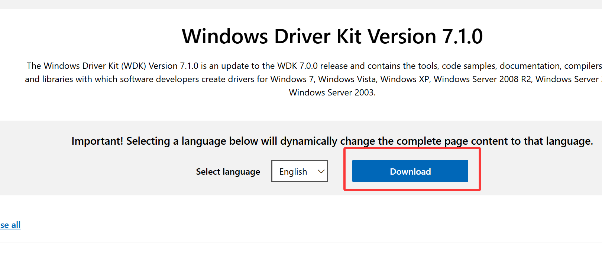
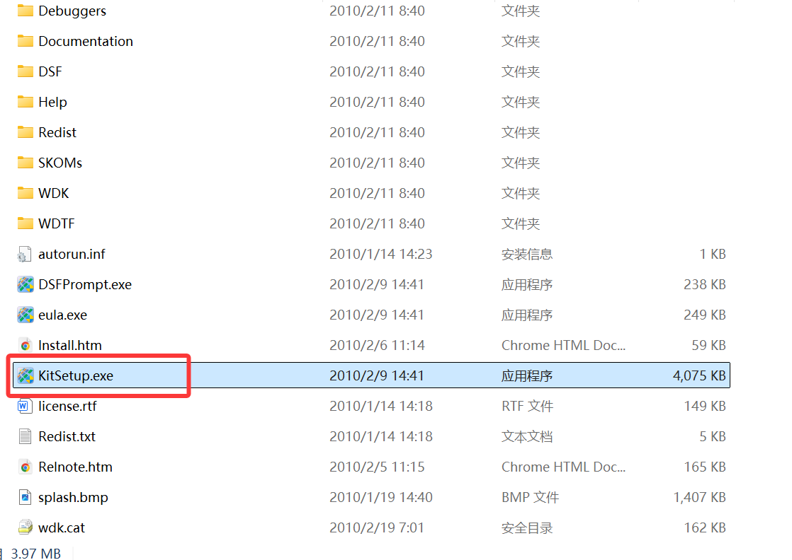
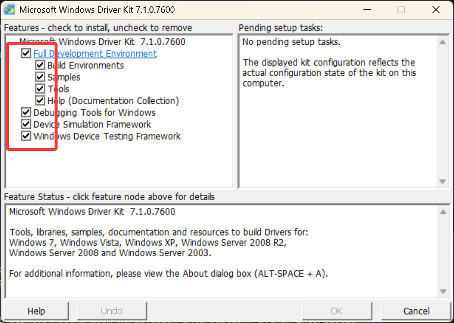
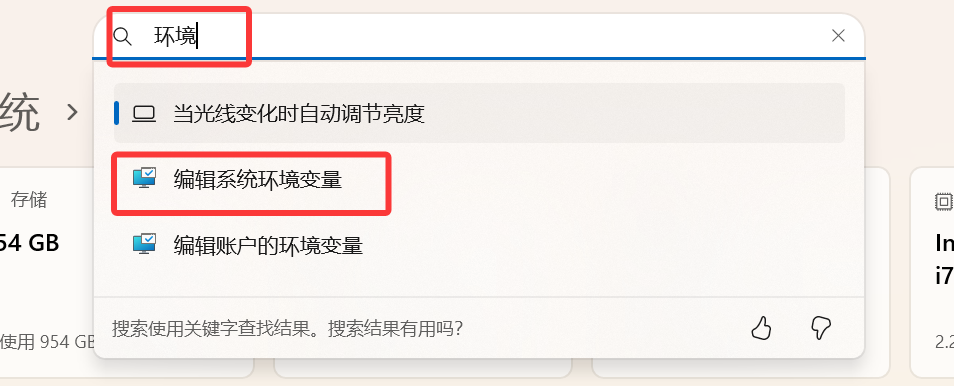
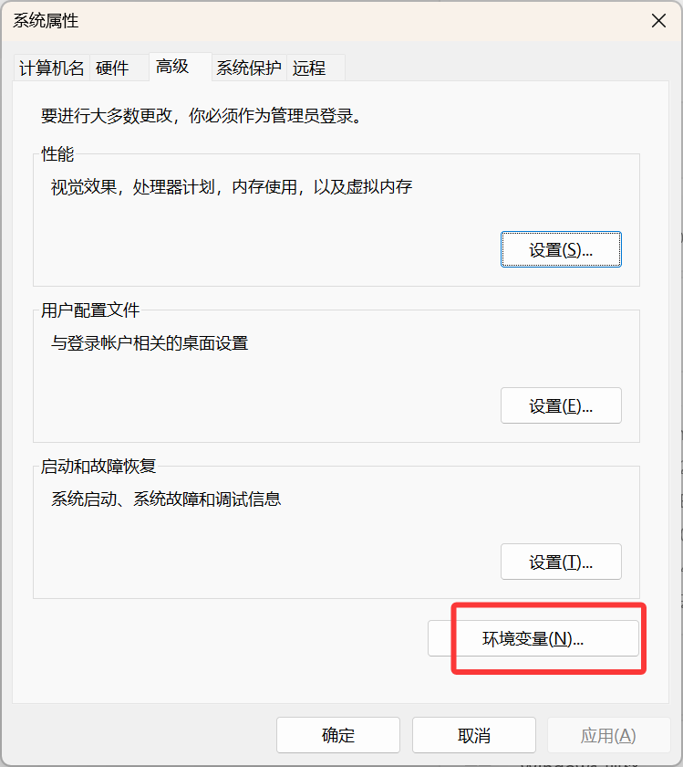
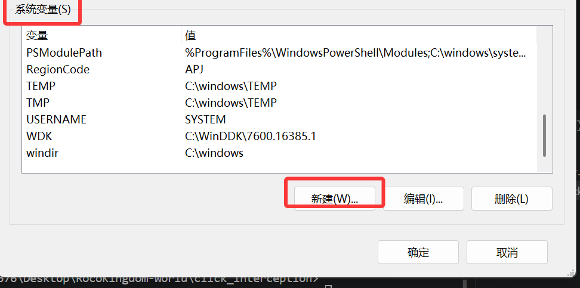
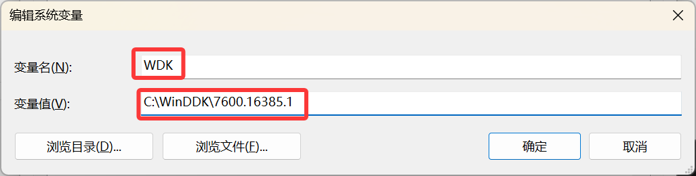
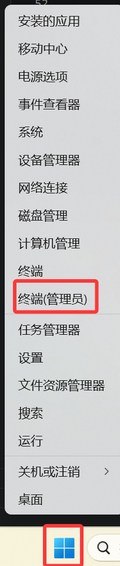

# 安装 Interception 

## 1. 安装 Windows Driver Kit Version 7.1.0

从官网下载 ISO 文件 [Windows Driver Kit Version 7.1.0](https://www.microsoft.com/en-us/download/details.aspx?id=11800)。



点击并安装全部内容。




## 2. 配置 Windows Driver Kit 的环境变量

设置中搜索变量，点击编辑系统环境变量






新建系统环境变量，名为 WDK ，内容为 Windows Driver Kit 的安装目录。





然后保存并退出。

## 3. 编译 Interception 的 DLL

构建 Interception，仓库中包含 x86/x64 的构建脚本。

在已设置 WDK 环境的管理员开发者命令提示符中运行：

```powershell
  cd Interception\library
  buildit.cmd      # 32-bit
  buildit-x64.cmd  # 64-bit
 ```

构建成功后，将生成的 `Interception\library\objfre_win7_amd64\amd64\interception.dll` 复制到本项目的根目录。

## 4. 安装 Interception 驱动

下载 Interception 的[发布版本](https://github.com/oblitum/Interception/releases/tag/v1.0.1)，解压后，将 `command line installer` 目录名改为 `installer`。

以管理员权限打开 CMD ：



CD 至 `installer` 目录后安装驱动：

```powershell
.\install-interception.exe /install
```

看到输出：
```
Interception command line installation tool
Copyright (C) 2008-2018 Francisco Lopes da Silva

Interception successfully installed. You must reboot for it to take effect.
```

最后重启电脑。